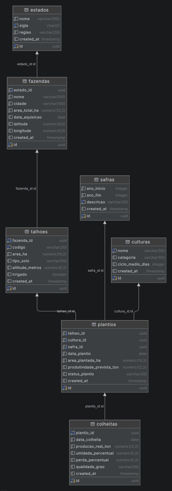

# Sistema de Gestão de Banco de Dados - Agronegócio

Este projeto consiste na modelagem e implementação de um banco de dados robusto utilizando **PostgreSQL**, focado na simulação de uma empresa de gestão do agronegócio. O objetivo principal é gerenciar diferentes culturas agrícolas distribuídas em diversas localidades, permitindo o desenvolvimento de análises avançadas aplicadas ao setor.

---

## 🗺️ Esquema do Banco de Dados (ERD)

Abaixo está o diagrama de entidade-relacionamento que representa a arquitetura de dados do projeto. Este desenho técnico ilustra como as entidades foram normalizadas e conectadas para garantir a integridade dos dados históricos da empresa.

### 📊 Explicação da Arquitetura de Dados

O banco de dados foi estruturado seguindo as melhores práticas de modelagem relacional, dividindo o fluxo de informação em três pilares principais:

1. **Estrutura Geográfica e Propriedades:** * A tabela `estados` se conecta a `fazendas`, permitindo agrupamentos e análises regionais.
   * Cada fazenda é subdividida em múltiplos `talhoes`. A tabela `talhoes` armazena a extensão física total da área (`area_ha`) e possui uma flag essencial (`irrigado`), que permite segmentar os resultados de produtividade entre áreas com tecnologia de irrigação (ex: Pivô Central) e áreas de sequeiro puro.

2. **Planejamento e Ciclo Produtivo (`plantios`):**
   * A tabela centralizada de `plantios` funciona como o elo do sistema, unindo a área física (`talhao_id`), o produto agrícola (`cultura_id`) e o período temporal (`safra_id`).
   * Nela são registrados dados dinâmicos do ciclo, como a **`area_plantada_ha`** utilizada naquele período e a estimativa de **`produtividade_prevista_ton`**, estabelecendo as metas e previsões antes da colheita.

3. **Resultados e Inteligência de Negócio (`colheitas`):**
   * A tabela `colheitas` aponta diretamente para o seu respectivo ciclo em `plantios` via `plantio_id`, garantindo a rastreabilidade total do que foi planejado versus o que foi executado.
   * Ela consolida a **`producao_real_ton`**, além de métricas de qualidade e perdas (`umidade_percentual`, `perda_percentual`, `qualidade_grao`). É o cruzamento entre `plantios` e `colheitas` que viabiliza o cálculo de indicadores críticos, como o desvio percentual de quebra de safra ocasionado por crises hídricas ou climáticas.

---

## 🚀 Estrutura do Projeto

O repositório está organizado para facilitar a manutenção e a execução sequencial dos scripts:

### 📂 `scripts/`
Contém os arquivos SQL principais para a construção e manipulação do banco de dados.

* **`ddl/` (Data Definition Language):** Scripts de criação de tabelas, tipos e restrições. Define a estrutura do banco.
* **`dml/` (Data Manipulation Language):** Scripts para inserção de dados e registros necessários para popular a simulação.

### 📂 `data/`
Armazena arquivos de dados brutos e planilhas de consolidação que servem de base para o projeto.

### 📂 `queries/`
Pasta dedicada ao desenvolvimento de inteligência de dados, incluindo relatórios de produtividade, análises de desempenho por localidade e métricas de eficiência utilizando CTEs (Common Table Expressions).

---

## 🌾 O Cenário do Projeto

A simulação abrange o gerenciamento de:

* **Múltiplas Culturas:** Registro de diferentes tipos de plantio e seus ciclos produtivos.
* **Diversas Localidades:** Gestão de fazendas em regiões distintas para comparação de eficiência.
* **Análises Aplicadas:** Estrutura focada em gerar insights estratégicos para o setor agro (como cenários de crise hídrica e quebra de safra).

---

## 🛠️ Tecnologias Utilizadas

* **SGBD:** PostgreSQL
* **IDE / Ferramenta de Banco:** JetBrains DataGrip
* **Linguagem:** SQL